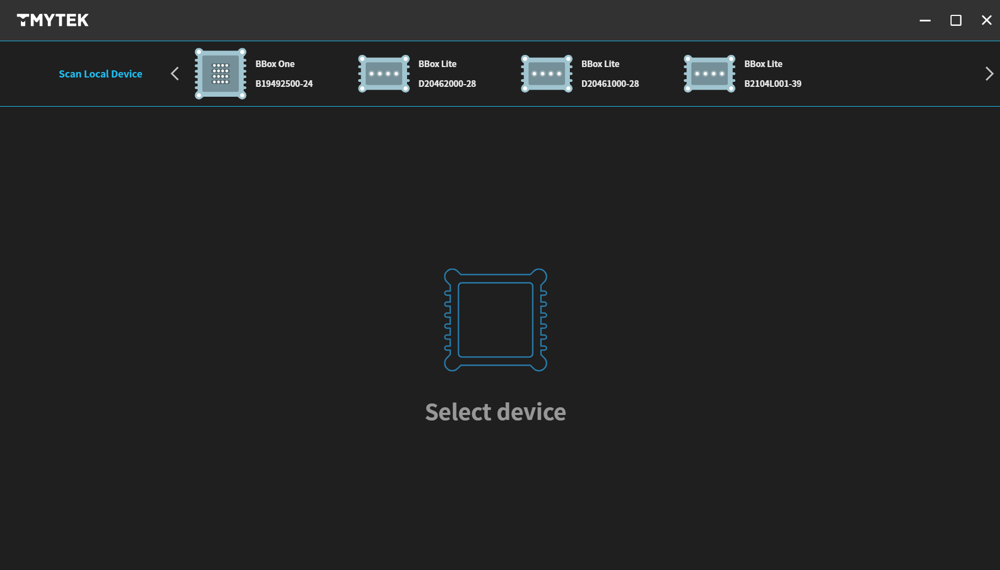
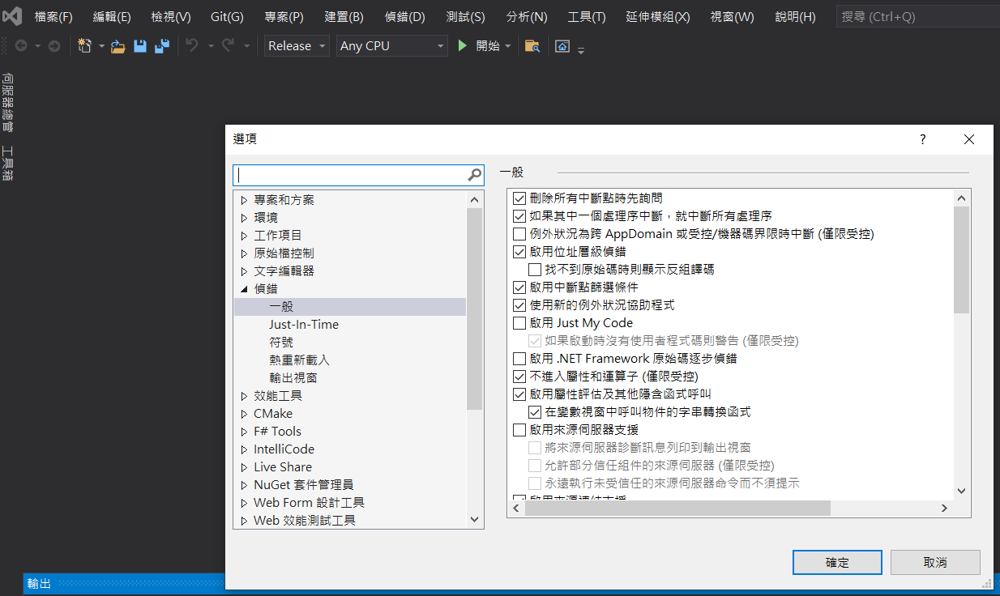

# **TMYTEK Box Series API Documentation** 

## **Introduction**


TMYTEK Box Series API helps developing mmwave( n257 / n260 ) **beamforming** and **beam steering** applications with **BBox 5G Series(mmwave beamformer)** and **UDBox 5G Series(mmwave Up-down converter)**. 

The .dll format release is windows shared library and test on visual studio community 2019 and labView 2019.

Every model has its own sample code. Please refer to the sample code inside each folder for the specific programming language.


[[ Product Video1 ](https://www.youtube.com/watch?v=-koKf-OOsVA)]
[[ Product Video2 ](https://www.youtube.com/watch?v=TRZwXUKOqUU)]
[[ Product Video3 ](https://www.youtube.com/watch?v=bnvj6L9CLHs)]

---

## **Getting Started**

- Sample Code Version : v1.5.0

- API Version: v3.3.15.14

- Release Date: July., 2022

- Latest Release : [[Download Link](https://github.com/tmytek/bbox-api/releases/tag/v1.5.0)]

<!-- toc -->

- Overview
    - [Introduction](#Introduction)
    - [Prerequisites](#Prerequisites)
        - [Network settings](#Network-settings)
        - [Python Environment Setup](#Python-Environment-Setup)
        - [Visual C++ and Visual C# Environment](#Visual-C++-and-Visual-C#-Environment)
    - [Sample Code Description](#Sample-Code-Description)
        - [ Python ]
        - [ C++ ]
        - [ C# ]
        - [ Labview ]
        - [ Matlab ]
    - [BBox Series Common API Usage](#BBox-Series-Common-API-Usage)
        - [ ScanningDevice ]      : Query the Active Devices Information on Ethernet
        - [ Init ]                : Initialize the Default Device Settings
        - [ getTxRxMode ]         : Query Device Operating Mode
        - [ SwitchTxRxMode ]      : Set Device Operating Mode
    - [BBoard 5G Series API Usage](#BBoard-5G-Series-API-Usage)
        - [ switchChannelPower ]  : Set Device channel power on or off
        - [ setChannelPhaseStep ] : Set Device channel eleemnt phase step
        - [ setChannelGainStep ]  : Set Device channel element gain step
        - [ setCommonGainStep ]   : Set Device Common common gain step
        - [ getTemperatureADC ]   : Get Device RF board temperature adc value 
    - [BBoxLite 5G Series API Usage](#BBoxLite-5G-Series-API-Usage)
        - [ switchChannelPower ]  : Set Device channel power on or off
        - [ setChannelGainPhase ] : Set Device channel Gain and Phase settings
        - [ setBeamAngle ] : Set Device Beam Steering Angle
    - [BBoxOne 5G Series API Usage](#BBoxOne-5G-Series-API-Usage)
        - [ switchChannelPower ]  : Set Device channel power on or off
        - [ setChannelGainPhase ] : Set Device channel Gain and Phase settings
        - [ setBeamAngle ]        : Set Device Beam Steering Angle
    - [UDBox API Usage](#UDBox-5G-Series-API-Usage)
        - [ GetState ] : Get UDBox device settings
        - [ SetState ] : Set UDBox device settings
        - [ Set Freq ] : Set LO/RF/IF/Bandwidth in KHz


<!-- tocstop -->


## **Prerequisites**

### **Network settings**

- Check network connection : Open [TMXLAB Kit](https://tmytek.com/resources/downloads) to make sure device can be connected

    

    


### **Python Environment Setup**

- Python version  : python-3.7.7 32-bit : [[Download Link](https://www.python.org/downloads/release/python-377/)]

- External modules can be install with Setup.bat in pre-install/

<pre><code>$ bbox-api\pre-install\Setup.bat</code></pre> 


### **Visual C++ and Visual C# Environment**

- Step 1 :
Visual Studio version : 2019 community : [[Download Link](https://visualstudio.microsoft.com/zh-hant/downloads/)]

- Step 2 : Disable Visual_studio just my code : [[Ref_Link](https://docs.microsoft.com/zh-tw/visualstudio/debugger/just-my-code?view=vs-2019)]


- Final Step : BBoxLite 5G sample code : [[Download Link](https://github.com/tmytek/bbox-api/blob/master/example/BBoxLite/second_generation/Python/BBOXLITE_DEMO.py)]

```

DEMO1 : Switch TX Mode

DEMO2 : Channel 1 Power Off

DEMO3 : Channel Gain/Phase Control

DEMO4 : Device Beam Steering Control

```

## **Sample Code Description**

### **Python** 

- [BBoard 5G Series](https://github.com/tmytek/bbox-api/tree/master/example/BBoard%20Series/Python)

- [BBoxLite 5G Series](https://github.com/tmytek/bbox-api/tree/master/example/BBoxLite%20Series/BBoxLite%205G/Python)

- [BBoxOne 5G Series](https://github.com/tmytek/bbox-api/tree/master/example/BBoxOne%20Series/BBoxOne%20%205G/Python)


### **C++**

- [BBoard 5G Series](https://github.com/tmytek/bbox-api/tree/master/example/BBoard%20Series/C%2B%2B)

- [BBoxLite 5G Series](https://github.com/tmytek/bbox-api/tree/master/example/BBoxLite%20Series/BBoxLite%205G/C%2B%2B)

- [BBoxOne 5G Series](https://github.com/tmytek/bbox-api/tree/master/example/BBoxOne%20Series/BBoxOne%20%205G/C%2B%2B)


### **C#**

- [BBoard 5G Series](https://github.com/tmytek/bbox-api/tree/master/example/BBoard%20Series/C%23)

- [BBoxLite 5G Series](https://github.com/tmytek/bbox-api/tree/master/example/BBoxLite%20Series/BBoxLite%205G/C%23)

- [BBoxOne 5G Series](https://github.com/tmytek/bbox-api/master/example/BBoxOne%20Series/BBoxOne%20%205G/C%23)


### **Matlab**

- [BBoxOne 5G Series](https://github.com/tmytek/bbox-api/tree/master/example/BBoxOne%20Series/BBoxOne%20%205G/MatLab)

### **Labview**

- [BBoxLite 5G Series](https://github.com/tmytek/bbox-api/tree/master/example/BBoxLite%20Series/BBoxLite%205G/LabView2017/BBoxLite28A)

- [BBoxOne 5G Series](https://github.com/tmytek/bbox-api/tree/master/example/BBoxOne%20Series/BBoxOne%20%205G/LabView2019)


## **BBox Series Common API Usage**

## ***ScanningDevice***
#### **Query the Active Devices Information on Ethernet**
---

```
string[] ScanningDevice(DEV_SCAN_MODE scanMode)
```

#### ***Function definition***

| Param Type              | Param Name    | Param Value    | Note        |
| ---                     | ---           | ---            | ---         |
| Integer (DEV_SCAN_MODE) | scanMode      | 0              | Normal mode |


| Return Type             | Name           | Return Value                                                           | Note |
| ---                     | ---            | ---                                                                    | ---  |
| string Array            | Device Info    | { "D2104L011-28,192.168.100.111,9", "D2104L012-28,192.168.100.112,9" } | { "Device1_SN,Device1_IP,Device1_type", "Device2_SN,Device2_IP,Device2_type" } |

## **Init**
#### ***Initialize the Default Device Settings***
---

```
int Init(sn, dev_type, idx)
```

#### ***Function definition***

| Param Type              | Param Name    | Param Value    | Note                                                     |
| ---                     | ---           | ---            | ---                                                      |
| string                  | sn            | "D2104L011-28" | Serial Numnber from ScanningDevice return value          |
| int                     | dev_type      | 9              | Device Type from ScanningDevice return Device type value |
| int                     | idx           | 0              | default value                                            |


| Return Type             | Name           | Return Value                       | Note          |
| ---                     | ---            | ---                                | ---           |
| Integer                 | Return Code    | 0                                  | Status OK     |


## **getTxRxMode**
#### ***Query Device Operating Mode***
---

```
int getTxRxMode(string sn)
```

| Param Type              | Param Name    | Param Value    | Note                                               |
| ---                     | ---           | ---            | ---                                                |
| string                  | sn            | "D2104L011-28" | Serial Numnber from ScanningDevice return value    |


| Return Type             | Name           | Return Value   | Note                                               |
| ---                     | ---            | ---            | ---                                                |
| Integer                 | Mode           | 1              | Standby : 0, TX : 1, RX : 2                        |

## **SwitchTxRxMode**
#### ***Set Device Operating Mode***
---

```
int SwitchTxRxMode(int mode, string sn)
```

#### ***Function definition***

| Param Type              | Param Name    | Param Value    | Note                              |
| ---                     | ---           | ---            | ---                               |
| Integer                 | mode          | 1              | Standby : 0, Tx : 1, Rx : 2       |
| string                  | sn            | "D2104L011-28" | Device Serial Number              |


| Return Type             | Name           | Return Value   | Note                              |
| ---                     | ---            | ---            | ---                               |
| Integer                 | Return Code    | 0              | Status OK                         |


---
## **BBoard 5G Series API Usage**

## **switchChannelPower**
#### ***Set Device channel power on or off***
---

```
string switchChannelPower(int board, int ch, int sw, string sn)
```

| Parameter Type          | Name            | value           | Note                                    |
| ---                     | ---             | ---             | ---                                     |
| int                     | board           | 1               | Board number : 1                        |
| int                     | ch              | 1               | Channel number in range(1, 4)           |
| int                     | sw              | 1               | Channel On/Off : ON - 0 , OFF - 1       |
| string                  | sn              | "D2104L011-28"  | Device Serial Number                    |

| Return Value Type       | Name            | Value           | Note          |
| ---                     | ---             | ---             | ---           |
| string                  | Return Status   | "OK"            | Status OK     |


## **setChannelPhaseStep**
#### ***Set Device channel element phase step***
---

```
int setChannelPhaseStep(int board, int ch, int phase_step, string sn)
```

| Parameter Type          | Name            | value           | Note                                                    |
| ---                     | ---             | ---             | ---                                                     |
| int                     | board           | 1               | Board number : 1                                        |
| int                     | ch              | 1               | Channel number in range(1, 4)                           |
| int                     | phase_step      | 0               | Element gain step in range(0, 15), 5.625 deg per step   |
| string                  | sn              | "D2104L011-28"  | Device Serial Number                                    |

| Return Value Type       | Name            | Value           | Note          |
| ---                     | ---             | ---             | ---           |
| int                     | Return Status   | 0               | Status OK     |


## **setChannelGainStep**
#### ***Set Device channel element gain step***
---

```
int setChannelGainStep(int board, int ch, int gain_step, string sn)
```

| Parameter Type          | Name            | value           | Note                                                |
| ---                     | ---             | ---             | ---                                                 |
| int                     | board           | 1               | Board number : 1                                    |
| int                     | ch              | 1               | Channel number in range(1, 4)                       |
| int                     | gain_step       | 0               | Element gain step in range(0, 15), 0.5db per step   |
| string                  | sn              | "D2104L011-28"  | Device Serial Number                                |

| Return Value Type       | Name            | Value           | Note          |
| ---                     | ---             | ---             | ---           |
| int                     | Return Status   | 0               | Status OK     |


## **setCommonGainStep**
#### ***Set Device channel common gain step***
---

```
int setCommonGainStep(int board, int ch, int gain_step, string sn)
```

| Parameter Type          | Name            | value           | Note                                    |
| ---                     | ---             | ---             | ---                                     |
| int                     | board           | 1               | Board number : 1                        |
| int                     | ch              | 1               | Channel number in range(1, 4)           |
| int                     | gain_step       | 0               | Common gain step in range(0, 15)        |
| string                  | sn              | "D2104L011-28"  | Device Serial Number                    |

| Return Value Type       | Name            | Value           | Note          |
| ---                     | ---             | ---             | ---           |
| int                     | Return Status   | 0               | Status OK     |


## **getTemperatureADC**
#### ***Get Device RF board temperature adc value***
---

```
int[] getTemperatureADC(string sn)
```

| Parameter Type          | Name            | value           | Note                                    |
| ---                     | ---             | ---             | ---                                     |
| string                  | sn              | "D2104L011-28"  | Device Serial Number                    |

| Return Value Type       | Name            | Value           | Note                      |
| ---                     | ---             | ---             | ---                       |
| int[]                   | Board ADC       | 0               | Temperatrue ADC sensor    |


---
## **BBoxLite 5G Series API Usage**

## **switchChannelPower**
#### ***Set Device channel power on or off***
---

```
string switchChannelPower(int board, int ch, int sw, string sn)
```

| Parameter Type          | Name            | value           | Note                                    |
| ---                     | ---             | ---             | ---                                     |
| int                     | board           | 1               | Board number : 1                        |
| int                     | ch              | 1               | Channel number in range(1, 4)           |
| int                     | sw              | 1               | Channel On/Off : ON - 0 , OFF - 1       |
| string                  | sn              | "D2104L011-28"  | Device Serial Number                    |

| Return Value Type       | Name            | Value           | Note          |
| ---                     | ---             | ---             | ---           |
| string                  | Return Status   | "OK"            | Status OK     |


## **setChannelGainPhase**
#### ***Set Device channel Gain and Phase settings***
---

```
string setChannelGainPhase(int board, int ch, double db, int phase, string sn)
```

### ***Function definition***

| Parameter Type          | Name            | value           | Note                                  |
| ---                     | ---             | ---             | ---                                   |
| int                     | board           | 1               | Board number : 1                      |
| int                     | ch              | 1               | Channel number in range(1, 4)         |
| double                  | db              | 10              | db in dynamic range                   |
| int                     | phase           | 45              | deg in range(0, 355, 5)               |
| string                  | sn              | "D2104L011-28"  | Device Serial Number                  |

| Return Value Type       | Name            | Value           | Note          |
| ---                     | ---             | ---             | ---           |
| string                  | Return Status   | "OK"            | Status OK     |


## **setBeamAngle**
#### ***Set Device Beam Steering Angle***
---

```
int setBeamAngle(double db, int theta, int phi, string sn)
```

### ***Function definition***

| Param Type              | Param Name    | Param Value           | Note                          |
| ---                     | ---           | ---                   | ---                           |
| double                  | db            | 10                    | DB in dynamic range           |
| int                     | theta         | 15                    | Theta value in range(0, 45)   |
| int                     | phi           | 180                   | Phi value 0 or 180            |
| string                  | sn            | "D2104L011-28"        | Device Serial Number          |

| Return Value Type       | Name          | Value        | Note          |
| ---                     | ---           | ---          | ---           |
| Integer                 | Return Code   | 0            | Status OK     |


---
## **BBoxOne 5G Series API Usage**

## **switchChannelPower**
#### ***Set Device channel power on or off***
---

```
string switchChannelPower(int board, int ch, int sw, string sn)
```

| Parameter Type          | Name            | value           | Note                                    |
| ---                     | ---             | ---             | ---                                     |
| int                     | board           | 1               | Board number in range(1, 4)             |
| int                     | ch              | 1               | Channel number in range(1, 4)           |
| int                     | sw              | 1               | Channel On/Off : ON - 0 , OFF - 1       |
| string                  | sn              | "D2104L011-28"  | Device Serial Number                    |

| Return Value Type       | Name            | Value           | Note          |
| ---                     | ---             | ---             | ---           |
| string                  | Return Status   | "OK"            | Status OK     |


## **setChannelGainPhase**
#### ***Set Device channel Gain and Phase settings***
---

```
string setChannelGainPhase(int board, int ch, double db, int phase, string sn)
```

### ***Function definition***

| Parameter Type          | Name            | value           | Note                                  |
| ---                     | ---             | ---             | ---                                   |
| int                     | board           | 1               | Board number in range(1, 4)           |
| int                     | ch              | 1               | Channel number in range(1, 4)         |
| double                  | db              | 10              | db in dynamic range                   |
| int                     | phase           | 45              | deg in range(0, 355, 5)               |
| string                  | sn              | "D2104L011-28"  | Device Serial Number                  |

| Return Value Type       | Name            | Value           | Note          |
| ---                     | ---             | ---             | ---           |
| string                  | Return Status   | "OK"            | Status OK     |


## **setBeamAngle**
#### ***Set Device Beam Steering Angle***
---

```
int setBeamAngle(double db, int theta, int phi, string sn)
```

### ***Function definition***

| Param Type              | Param Name    | Param Value           | Note                          |
| ---                     | ---           | ---                   | ---                           |
| double                  | db            | 10                    | DB in dynamic range           |
| int                     | theta         | 15                    | Theta value in range(0, 45)   |
| int                     | phi           | 180                   | Phi value in range (0, 180)   |
| string                  | sn            | "D2104L011-28"        | Device Serial Number          |

| Return Value Type       | Name          | Value        | Note          |
| ---                     | ---           | ---          | ---           |
| Integer                 | Return Code   | 0            | Status OK     |

---

## **UDBox 5G Series API Usage**

## **GetState**

```
int GetState(int state_index, string sn)
```

### ***Function definition***

| Param Type    | Param Name  | Param Value                                                                                                       |
| ------        | ----------- | ----------------------------------------------------------------------------------------------------------------- |
| int           | state_index | 0: Lock<br>1: CH1<br>2: CH2<br>3: 10M output<br>4: 100M output<br>5: 100M source<br>6: LED 100M<br>7: 5V<br>8: 9V |
| string        | sn          | Device Serial Number                                                                                              |

| Return Value Type       | Name          | Value        | Note          |
| ---                     | ---           | ---          | ---           |
| Integer                 | Return state  | 0            | state_index   |

## **SetState**

```
int SetState(int state_index, int value, string sn)
```

### ***Function definition***

| Param Type    | Param Name  | Param Value                                                                                                       |
| ------        | ----------- | ----------------------------------------------------------------------------------------------------------------- |
| int           | state_index | 0: Lock<br>1: CH1<br>2: CH2<br>3: 10M output<br>4: 100M output<br>5: 100M source<br>6: LED 100M<br>7: 5V<br>8: 9V |
| int           | value       | value                                                                                                             |
| string        | sn          | Device Serial Number                                                                                              |

return state from the state_index

| Return Value Type       | Name          | Value        | Note          |
| ---                     | ---           | ---          | ---           |
| Integer                 | Return state  | 0            | state_index   |

## **Set Freq**

```
string SetUDFreq(double freq_ud, double freq_rf, double freq_if, double freq_bandwidth, string sn)
```

### ***Function definition***

| Param Type    | Param Name     | Param Value              |
| ------        | -------------- | ------------------------ |
| double        | freq_ud        | UD/LO frequency(KHz)     |
| double        | freq_rf        | RF frequency(KHz)        |
| double        | freq_if        | IF frequency(KHz)        |
| double        | freq_bandwidth | Bandwidth frequency(KHz) |
| string        | sn             | Device Serial Number     |

| Return Value Type       | Name          | Value        | Note          |
| ---                     | ---           | ---          | ---           |
| Integer                 | Return Code   | 0            | Status OK     |
