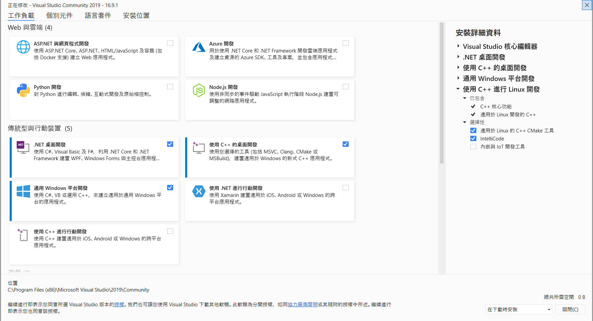

# **BBox API Documentation**

## **Getting Started**

- Sample Code version : v1.4.0

- API Version: v3.3.15.10

- Release date: June., 2022

- Latest release : [Download Link](https://github.com/tmytek/bbox-api/releases/tag/v1.4.0)

<!-- toc -->
- Overview
    - [Introduction](#Introduction)
    - [Prerequisites](#Prerequisites)
        - [Network settings](#Network-settings)
        - [Python Environment Setup](#Python-Environment-Setup)
        - [Visual C++ and Visual C# Environment](#Visual-C++-and-Visual-C#-Environment)
    - [Documentation](#Documentation)
        - [Python](#Python)
        - [C++](#C++)
        - [C#](#C#)
        - [Labview](#Labview)
    - [BBox 5G Series API Usage](#BBox-5G-Series-API-Usage)
        - [ScanningDevice](#ScanningDevice)
            - [Query the Active Devices Information on Ethernet](#Query-the-Active-Devices-Information-on-Ethernet)
        - [Init](#Init)
            - [Initialize the Default Device Settings](#Initialize-the-Default-Device-Settings) 
        - [getTxRxMode](#getTxRxMode)
            - [Query Device Operating Mode](#Query-Device-Operating-Mode)
        - [SwitchTxRxMode](#SwitchTxRxMode)
            - [Set Device Operating Mode](#Set-Device-Operating-Mode) 
        - [setBeamAngle](#setBeamAngle)
            - [Set Device Beam Steering Angle](#Set-Device-Beam-Steering-Angle) 
        - [setChannelGainPhase](#setChannelGainPhase)
            - [Set Device channel Gain and Phase settings](#Set-Device-channel-Gain-and-Phase-settings)
        - [switchChannelPower](#switchChannelPower)
            - [Set Device channel power on or off](#Set-Device-channel-power-on-or-off) 


<!-- tocstop -->

## **Introduction**

BBox API helps developers building their own applications. The release format is DLL and currently only support Windows operating system. The tested environment is Visual Studio community 2019 and LabView 2019.

Every model has its own sample code. Please refer to the sample code inside each folder for different programming language.

## **Prerequisites**

### **Network settings**

- Check network connection : Open TMXLAB Kit to make sure device can be connected

    

    


### **Python Environment Setup**

- Python version  : python-3.7.7 32-bit : [Download Link](https://www.python.org/downloads/release/python-377/)

- External modules can be install with Setup.bat in pre-install/

<pre><code>$ bbox-api\pre-install\Setup.bat</code></pre> 


### **Visual C++ and Visual C# Environment**

- Step 1 :
Visual Studio version : 2019 community : [[Download Link](https://visualstudio.microsoft.com/zh-hant/downloads/)]

- Step 2 : Select targets : Install and Update 


- Step 3 : Disable Visual_studio just my code : [[Ref_Link](https://docs.microsoft.com/zh-tw/visualstudio/debugger/just-my-code?view=vs-2019)]


- Final Step : BBoxLite 5G sample code : [[Download Link](https://github.com/tmytek/bbox-api/blob/master/example/BBoxLite/second_generation/Python/BBOXLITE_DEMO.py)]

```
"""
DEMO1 : Switch TX Mode

DEMO2 : Channel 1 Power Off

DEMO3 : Channel Gain/Phase Control

DEMO4 : Device Beam Steering Control
"""

$ python BBOXLITE_DEMO.py
```

## **Documentation**

### *Python** 

- [BBoxLite 5G Series](https://github.com/tmytek/bbox-api/tree/master/example/BBoxLite%20Series/BBoxLite%205G/Python)

- [BBoxOne 5G Series](https://github.com/tmytek/bbox-api/tree/BXO28A-315/Upgrade-API-Version/example/BBoxOne%20Series/BBoxOne%20%205G/Python)


### **C++**

- [BBoxLite 5G Series](https://github.com/tmytek/bbox-api/tree/master/example/BBoxLite%20Series/BBoxLite%205G/C%2B%2B)

- [BBoxOne 5G Series](https://github.com/tmytek/bbox-api/tree/BXO28A-315/Upgrade-API-Version/example/BBoxOne%20Series/BBoxOne%20%205G/C%2B%2B)


### **C#**

- [BBoxLite 5G Series](https://github.com/tmytek/bbox-api/tree/master/example/BBoxLite%20Series/BBoxLite%205G/C%23)

- [BBoxOne 5G Series](https://github.com/tmytek/bbox-api/tree/BXO28A-315/Upgrade-API-Version/example/BBoxOne%20Series/BBoxOne%20%205G/C%23)

### **Labview**

- [BBoxLite 5G Series](https://github.com/tmytek/bbox-api/tree/master/example/BBoxLite%20Series/BBoxLite%205G/LabView2017/BBoxLite28A)

- [BBoxOne 5G Series](https://github.com/tmytek/bbox-api/tree/BXO28A-315/Upgrade-API-Version/example/BBoxOne%20Series/BBoxOne%20%205G/LabView2019)


---
## **BBox 5G Series API Usage**
### ***ScanningDevice***
#### **Query the Active Devices Information on Ethernet**
---

```
public string[] ScanningDevice(DEV_SCAN_MODE scanMode)
```

#### ***Function definition***

| Parameter Type          | Name     | value    | Note        |
| ---                     | ---      | ---      | ---         |
| Integer (DEV_SCAN_MODE) | scanMode | 0        | Normal mode |


| Return Value Type      | Name        | Value                              | Note |
| ---                    | ---         | ---                                | ---  |
| String Array           | Device Info | { "D2104L011-28,192.168.100.111,9", "D2104L012-28,192.168.100.112,9" } | { "Device1_SN,Device1_IP,Device1_type", "Device2_SN,Device2_IP,Device2_type" } |

### **Init**
#### ***Initialize the Default Device Settings***
---

```
public int Init(sn, dev_type, idx)
```

#### ***Function definition***

| Parameter Type          | Name     | value          | Note            |
| ---                     | ---      | ---            | ---             |
| String                  | sn       | "D2104L011-28" | Serial Numnber from ScanningDevice return sn value |
| int                     | dev_type | 9              | Device Type from ScanningDevice return Device type value |
| int                     | idx      | 0              | default value   |


| Return Value Type      | Name        | Value                              | Note          |
| ---                    | ---         | ---                                | ---           |
| Integer                | Return Code | 0                                  | API status OK |


### **getTxRxMode**
#### ***Query Device Operating Mode***
---

```
public int getTxRxMode(String sn); 
```

| Parameter Type          | Name     | value          | Note            |
| ---                     | ---      | ---            | ---             |
| String                  | sn       | "D2104L011-28" | Serial Numnber from ScanningDevice return sn value |


| Return Value Type      | Name        | Value        | Note          |
| ---                    | ---         | ---          | ---           |
| Integer                | Mode        | 1            | Standby : 0, TX : 1, RX : 2 |

### **SwitchTxRxMode**
#### ***Set Device Operating Mode***
---

```
public int SwitchTxRxMode(int mode, String sn)
```

#### ***Function definition***

| Parameter Type          | Name     | value          | Note                 |
| ---                     | ---      | ---            | ---                  |
| Integer                 | mode     | 1              | Tx : 1, Rx : 2       |
| String                  | sn       | "D2104L011-28" | Device serial number |

| Return Value Type      | Name        | Value        | Note          |
| ---                    | ---         | ---          | ---           |
| Integer                | Return Code | 0            | API status OK |

### **setBeamAngle**
#### ***Set Device Beam Steering Angle***
---

```
public int setBeamAngle(double db, int theta, int phi, String sn)
```

### ***Function definition***

| Parameter Type          | Name     | value                 | Note                 |
| ---                     | ---      | ---                   | ---                  |
| double                  | db       | 10                    | DB in dynamic range  |
| int                     | theta    | 15                    | Theta value          |
| int                     | phi      | 180                   | Phi value            |
| String                  | sn       | "D2104L011-28"        | Device serial number |

| Return Value Type      | Name        | Value        | Note          |
| ---                    | ---         | ---          | ---           |
| Integer                | Return Code | 0            | API status OK |

### **setChannelGainPhase**
#### ***Set Device channel Gain and Phase settings***
---

```
public string setChannelGainPhase(int board, int ch, double db, int phase, string sn)
```

### ***Function definition***

| Parameter Type          | Name            | value           | Note                                                                |
| ---                     | ---             | ---             | ---                                                                 |
| int                     | board           | 1               | (BBoxLite) Board number : 1 , (BBoxOne) Board number in range(1, 4) |
| int                     | ch              | 1               | (BBoxLite/BBoxOne) Channel number in range(1,4)                     |
| double                  | db              | 10              | db in dynamic range                                                 |
| int                     | phase           | 45              | deg in range(0,355,5)                                               |
| String                  | sn              | "D2104L011-28"  | Device serial number                                                |

| Return Value Type      | Name          | Value           | Note          |
| ---                    | ---           | ---             | ---           |
| String                 | Return Status | "OK"            | API status OK |

----------
### **switchChannelPower**
#### ***Set Device channel power on or off***
---

```
public string switchChannelPower(int board, int ch, int sw, string sn)
```

| Parameter Type          | Name            | value           | Note                                                                |
| ---                     | ---             | ---             | ---                                                                 |
| int                     | board           | 1               | (BBoxLite) Board number : 1 , (BBoxOne) Board number in range(1, 4) |
| int                     | ch              | 1               | (BBoxLite/BBoxOne) Channel number in range(1,4)                     |
| int                     | sw              | 1               | (BBoxLite/BBoxOne) Channel On/Off : ON - 0 , OFF - 1                |
| String                  | sn              | "D2104L011-28 " | Device serial number                                                |

| Return Value Type      | Name          | Value           | Note          |
| ---                    | ---           | ---             | ---           |
| String                 | Return Status | "OK"            | API status OK |

---

