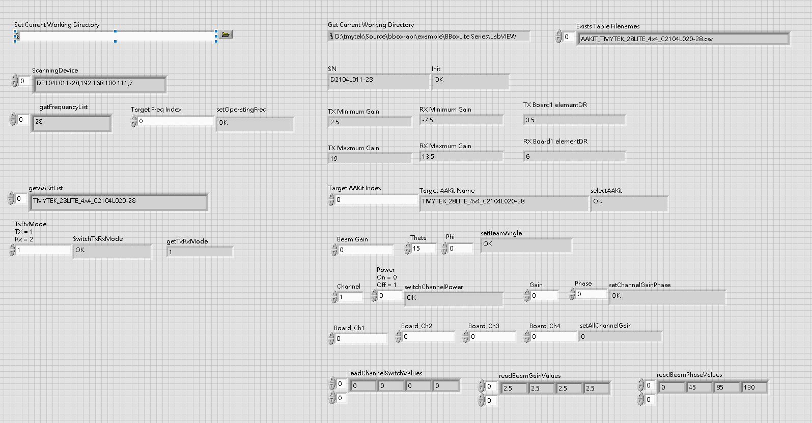

# BBox API Document

BBox API helps developers building their own applications. The release format is DLL and currently only support Windows operating system. The functions in DLL could be import in LabView. The tested environment and example is based on LabView2021.

## Labview Getting Started

   
1. Add your calibration table (eg. D20462000-28.csv) and AAKIT table (eg. AAKIT_TMYTEK_28LITE_4x4_C2104L020-28.csv) into .\bbox-api\example\BBoxLite Series\LabVIEW\files\

2. Open LabView project file (BBoxLite.lvproj) and click BBoxLite.vi

3. Set current working directory path such as .\bbox-api\example\BBoxLite Series\LabVIEW\

4. Operate > Run

# API Description

## Init

    int Init(string sn)
| Type | Name | Value                                        |
| ------------ | ------------ | -----------------------------|
| string       | sn           | sn                           |

----------

## SwitchTxRxMode

    int SwitchTxRxMode(int trmode, string sn)
| Type | Name | Value                                        |
| ------------ | ------------ | -----------------------------|
| int          | trmode       | Tx : 1 Rx : 2                |
| string       | sn           | sn                           |

----------

## selectAAKit

    int selectAAKit(string AAKitName, string sn);
| Type | Name | Value                                                 |
| ------------ | ------------ | ------------------------------------- |
| string       | AAKitName    | ex. TMYTEK_28LITE_4x4_C2104L020-28    |
| string       | sn           | sn                                    |

----------

## setChannelGainPhase

    string setChannelGainPhase(int board, int ch, double db, int phase, string sn)
| Type         | Name         | Value                                                 |
| ------------ | ------------ | ----------------------------------------------------- |
| int          | board        | fixed at 1                                            |
| int          | ch           | range from 1 to 4                                     |
| double       | db           | range from max_gain to min_gain in tx mode or rx mode |
| int          | phase        | range from 0 to 355                                   |
| string       | sn           | sn                                                    |

----------

## setAllChannelGain

    int setAllChannelGain(int board, double ch1_db, double ch2_db, double ch3_db, double ch4_db, string sn)
| Type         | Name         | Value                                                 |
| ------------ | ------------ | ----------------------------------------------------- |
| int          | board        | range from 1                                          |
| double       | ch1_db       | range from max_gain to min_gain in tx mode or rx mode and ch settings cannot exceed elementDR (Detailed in BBoxLite.vi) |
| double       | ch2_db       | range from max_gain to min_gain in tx mode or rx mode and ch settings cannot exceed elementDR (Detailed in BBoxLite.vi)  |
| double       | ch3_db       | range from max_gain to min_gain in tx mode or rx mode and ch settings cannot exceed elementDR (Detailed in BBoxLite.vi)  |
| double       | ch4_db       | range from max_gain to min_gain in tx mode or rx mode and ch settings cannot exceed elementDR (Detailed in BBoxLite.vi)  |
| string       | sn           | sn                                                    |

----------

## setBeamAngle

    int setBeamAngle(double db, int theta, int phi, string sn)
| Type         | Name         | Value                                                 |
| ------------ | ------------ | ----------------------------------------------------- |
| double       | db           | range from max_gain to min_gain in tx mode or rx mode |
| int          | theta        | range from 0 to 45                                    |
| int          | phi          | 0 or 180                                              |
| string       | sn           | sn                                                    |

## Trouble shooting

----------

- [How to import dll into labview exe ?](https://knowledge.ni.com/KnowledgeArticleDetails?id=kA00Z000000kKgsSAE&l=zh-TW)
