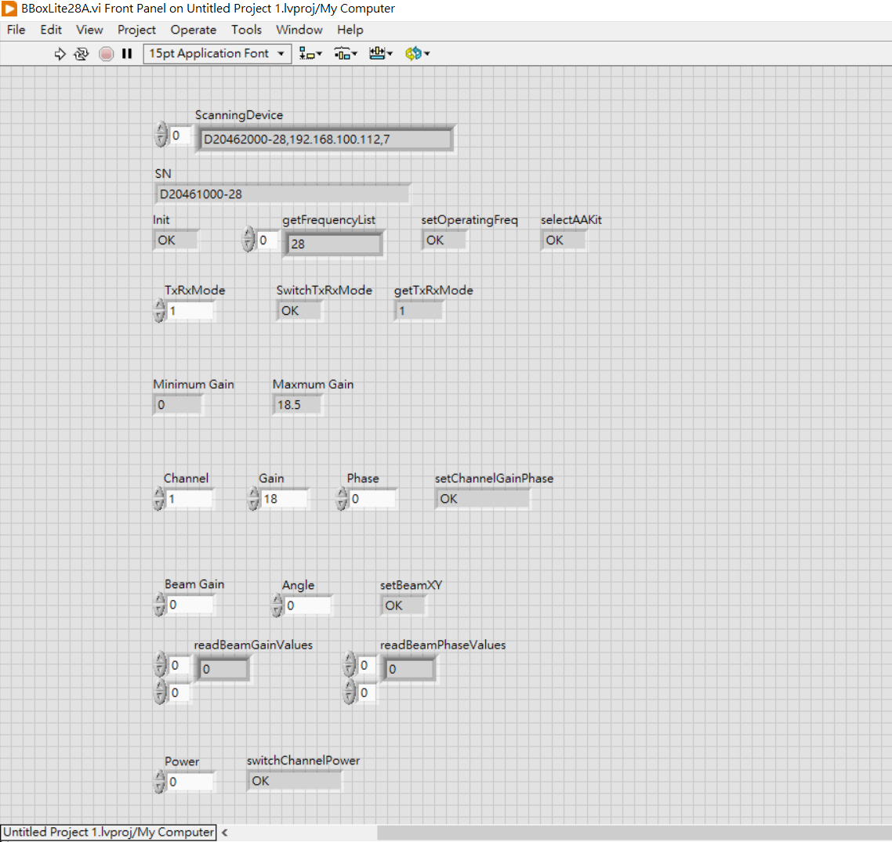
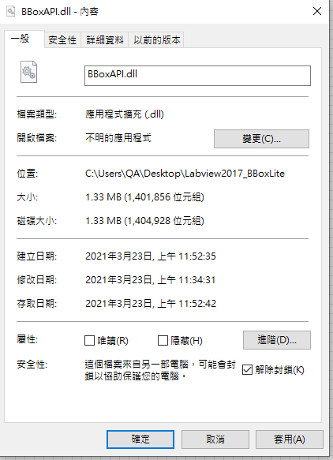

# BBox API Document
Version: v3.1.2.2
Release date: Mar., 2021 

## Introduction

BBox API helps developers building their own applications. The release format is DLL and currently only support Windows operating system. The functions in DLL could be import in LabView. The tested environment and example is baseed on LabView2019 and LabView2020 SP1.

## Running Sample Code

1. Check network connection : Open TMXLAB Kit to make sure device can be connected

    

2. Add your calibration table (eg. D20462000-28.csv) and AAKIT table (eg. AAKIT_TMYTEK_28LITE_4x4_C2104L020-28.csv) into .\bbox-api\example\BBoxLite\second_generation\LabView2019\BBoxLite28A\files\

3. Open LabView project file (Untitled Project 1.lvproj) and click BBoxLite28A.vi

4. Operate > Run

5. Result as below

    

----------

The LabView demo flow
****
Notice : The API is import to LabView environment by "Call Library Function Node" then you can find them on the LabView visual graphic. You can also modify the LabViewTest example for customized purpose. Please create a folder named "files" under the same folder with LabView Project files, and then put related table inside.
****
**Scanning the BBoxOne devices**
Scanning how many BBoxOne devices and then obtain the related Serial number and IP address

    public void ScanningDevice();

**Control Beam direction in x/y axis**
The core function of BBox is to control beam steering. The following code snippet steers beam in diffirent direction. Please refer to next section for API parameters.  

    public string setBeamXY(double db, int angx, int angy, string sn);

**Switch Tx & Rx mode**
BBox is TDD based device. 

    int SwitchTxRxMode(1, sn/*device sn*/); // Switch BBox to Tx mode
    int SwitchTxRxMode(2, sn/*device sn*/); // Switch BBox to Rx mode

----------
# API parameters

## Init
    public string Init(string sn, int dev_type, int idx);
| Type | Name | Value                                        |
| ------------ | ------------ | ------------------------------------------------ |
| string       | sn           | serial number of bbox one |
| int          | dev_type     | fixed at 7   |
| int          | idx          | bbox instance index   |

----------

## SwitchTxRxMode
    public int SwitchTxRxMode(int trmode, string sn);
| Type | Name | Value                                        |
| ------------ | ------------ | ------------------------------------------------ |
| int          | trmode         | Tx : 1 Rx : 2 |
| string       | sn           | bbox sn   |

----------
## selectAAKit
    public retCode selectAAKit(string AAKitName, string sn);
| Type | Name | Value                                        |
| ------------ | ------------ | ------------------------------------------------ |
| string       | AAKitName    | ex. TMYTEK_28LITE_4x4_C2104L020-28 |
| string       | sn           | bbox sn   |

----------

## setChannelGainPhase
    public string setChannelGainPhase(int board, int ch, double db, int phase, string sn);
| Type | Name | Value                                        |
| ------------ | ------------ | ------------------------------------------------ |
| int          | board        | fixed at 1 |
| int          | ch           | adjust channel(1~4) |
| double       | db           | gain value for channel |
| int          | phase        | phase value for channel |
| string       | sn           | bbox sn   |

----------

## setBeamXY
    public string setBeamXY(double db, int angx, int angy, string sn);
| Type | Name | Value                                        |
| ------------ | ------------ | ------------------------------------------------ |
| double       | db           | gain value for each channel |
| int          | angx         | -45 to 45 degree |
| int          | angy         | 0 degree |
| string       | sn           | bbox sn   |

----------

# Control range
## Tx dynamic range
| Gain  | 0.0 to 15.0 dB |
| -------- | ---- |
Resolution is 0.5 dB

## Rx dynamic range
| Gain  | -3.0 to 12.0 dB |
| -------- | ---- |
Resolution is 0.5 dB

## Tx/Rx phase range
| phase | 0-355  |
| -------- | ---- |
Resolution is 5 degrees

## Trouble shooting

BBoxAPI.dll may be lock.
----------
Ans : Unlock BBoxAPI.dll

BBoxAPI.dll is missing in the project file
----------
Ans : [Ref_Link](https://knowledge.ni.com/KnowledgeArticleDetails?id=kA00Z000000kKgsSAE&l=zh-TW)

BBoxLite28A.vi is missing in the project file
----------
Ans : [Ref_Link](https://knowledge.ni.com/KnowledgeArticleDetails?id=kA00Z000000kKgsSAE&l=zh-TW)