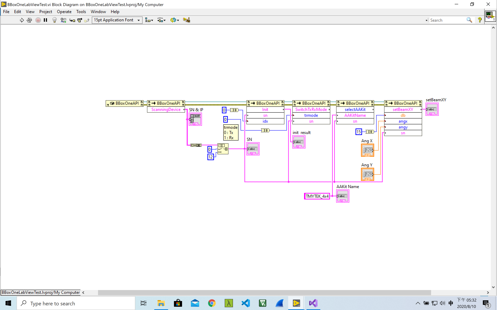

# BBox API Document
Version: v3.0.5
Release date: Aug., 2020 

## Introduction

BBox API helps developers building their own applications. The release format is DLL and currently only support Windows operating system. The functions in DLL could be import in LabView. The tested environment and example is baseed on LabView2019.

<!-- # Getting Started — LabView
## Installation
----------

Please import BBoxLiteAPI.dll from Visual Studio and use the following code segment to include the API.

    using BBoxLiteAPI;

## Initialization
----------
    BBoxAPI b = new BBoxAPI();
    b.Init(); // This will send the init command to BBox
 -->

## Control example

----------

The LabView demo flow
****
Notice : The API is import to LabView environment by "Call Library Function Node" then you can find them on the LabView visual graphic. You can also modify the LabViewTest example for customized purpose. Please create a folder named "files" under the same folder with LabView Project files, and then put related table inside.
****
**Scanning the BBoxOne devices**
Scanning how many BBoxOne devices and then obtain the related Serial number and IP address

    public void ScanningDevice();

**Control Beam direction in x/y axis**
The core function of BBox is to control beam steering. The following code snippet steers beam in diffirent direction. Please refer to next section for API parameters.  

    public string setBeamX(double db, int ang, string sn);
    public string setBeamY(double db, int ang, string sn);
    public string setBeamXY(double db, int angx, int angy, string sn);

**Switch Tx & Rx mode**
BBox is TDD based device. 

    int SwitchTxRxMode(0, sn/*device sn*/); // Switch BBox to Tx mode
    int SwitchTxRxMode(1, sn/*device sn*/); // Switch BBox to Rx mode

----------
# API parameters

## setBeamX
    public string setBeamX(double db, int ang, string sn);
| Type | Name | Value                                        |
| ------------ | ------------ | ------------------------------------------------ |
| double       | db           | gain value for each channel |
| int          | ang          | -45 to 45 degree |
| string       | sn           | bbox sn   |

## setBeamY
    public string setBeamY(double db, int ang, string sn);
| Type | Name | Value                                        |
| ------------ | ------------ | ------------------------------------------------ |
| double       | db           | gain value for each channel |
| int          | ang          | -60 to 60 degree |
| string       | sn           | bbox sn   |

## setBeamXY
    public string setBeamXY(double db, int angx, int angy, string sn);
| Type | Name | Value                                        |
| ------------ | ------------ | ------------------------------------------------ |
| double       | db           | gain value for each channel |
| int          | angx         | -45 to 45 degree |
| int          | angy         | -60 to 60 degree |
| string       | sn           | bbox sn   |

----------
## Init
    public string Init(string sn, int idx);
| Type | Name | Value                                        |
| ------------ | ------------ | ------------------------------------------------ |
| string       | sn           | serial number of bbox one |
| int          | idx          | bbox instance index   |

----------
## SwitchTxRxMode
    public int SwitchTxRxMode(int trmode, string sn);
| Type | Name | Value                                        |
| ------------ | ------------ | ------------------------------------------------ |
| int          | trmode         | Tx : 0, Rx : 1 |
| string       | sn           | bbox sn   |

## selectAAKit
    public retCode selectAAKit(string AAKitName, string sn);
| Type | Name | Value                                        |
| ------------ | ------------ | ------------------------------------------------ |
| string          | AAKitName         | ex. TMYTEK_4x4, TMYTEK_8x8 |
| string       | sn           | bbox sn   |

# Control range
## Tx dynamic range
| Gain  | 0.0 to 20.0 dB |
| -------- | ---- |
Resolution is 0.5 dB

## Rx dynamic range
| Gain  | -15.0 to 5.0 dB |
| -------- | ---- |
Resolution is 0.5 dB

## Tx/Rx phase range
| phase | 0-355  |
| -------- | ---- |
Resolution is 5 degrees

