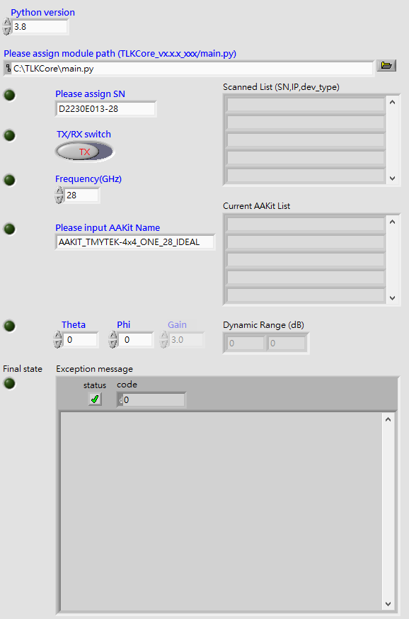
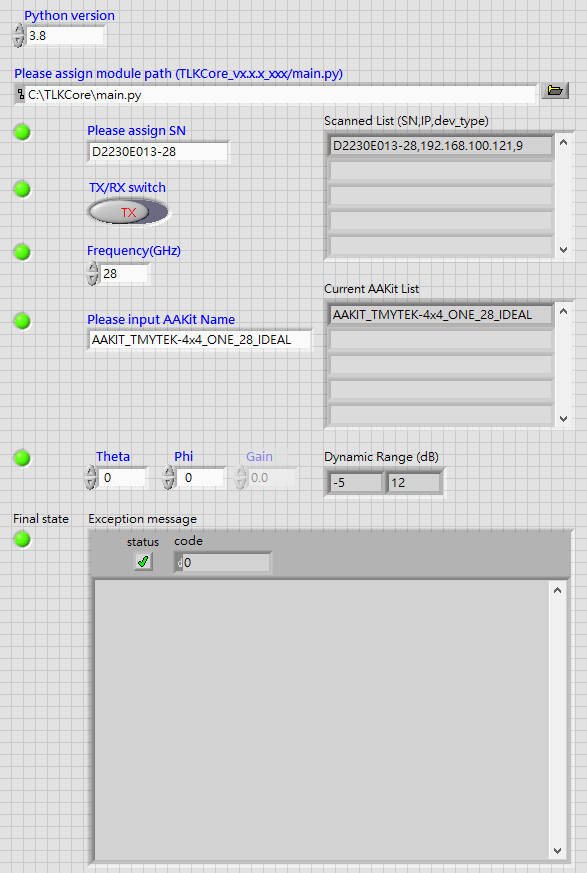

# Getting Started with LabVIEW Sample Code

## Prerequisites

1. Install Python *3.6 or 3.8 or 3.10* which mapping with [TLKCore_release](https://github.com/tmytek/bbox-api/tree/master/example_Linux/TLKCore_release), TLKCore libraries only support 64bit currently.
2. According to [Integrating Python Code in LabVIEW](https://www.ni.com/en/support/documentation/supplemental/18/installing-python-for-calling-python-code.html#section-1736000138) to download LabVIEW to maps your Python version. Please download 64bit version not 32bit.
   

3. Extract zip file under the [TLKCore_release](https://github.com/tmytek/bbox-api/tree/master/example_Linux/TLKCore_release)
4. Create the new directory named **files**
   
5. [BBoxOne/Lite] Copy your calibration & antenna tables into **files/** under the [TLKCore_release](https://github.com/tmytek/bbox-api/tree/master/example_Linux/TLKCore_release)
   * BBox calibration tables -> **{SN}_{Freq}GHz.csv**
   * BBox antenna table -> **AAKIT_{AAKitName}.csv**

P.S. The following example executes ==LabVIEW 2021 64bit & Pyhton 3.8 64bit== on Windows 10

## LabVIEW sample execution steps

1. Double-click BBox.vi or **TLKCore.lvproj** then BBox.vi.
   

2. Please check fields under the description with ==BLUE== color
   1. Python version
      * Choose/edit the Python version you want to test.
   2. Module path
      * Browse the path of main.py under the TLKCore release, then assign it.
   3. SN
      * Fill the SN on your device, or you can 'Run' it to get SN from 'Scanned List' then fill it.
   4. TX/RX mode
      * Press button to switch TX/RX mode.
   5. Frequency
      * Choose/edit the frequency.
   6. AAKit name
      * Fill the AAKit name in the BBox antenna table, or you can 'Run' it to fetch from 'Current AAKit List' then fill it.
   7. Beam setting
      * Theta: degree 0~60, with step 1
      * Phi: degree 0~360, with step 1
      * Gain(dB): this example only provides the **MAX value of dynamic range** or you can modify to your setting via modifying Block Diagram of LabVIEW
3. 'Run' it.
4. Expected result shall be
   

