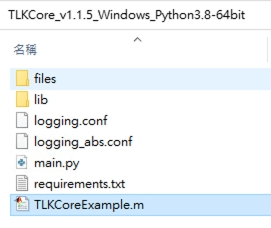

# Getting Started with MATLAB Sample Code

## Prerequisites

1. Install Python *3.6 or 3.8 or 3.10* which mapping with [TLKCore_release](https://github.com/tmytek/bbox-api/tree/master/example_Linux/TLKCore_release), and follow reference user guide of [Getting Started with Python Sample Code](https://github.com/tmytek/bbox-api/tree/master/example_Linux/Python/README.md) to make sure your Python environment first.
2. According to [Versions of Python Compatible with MATLAB Products by Release](https://www.mathworks.com/support/requirements/python-compatibility.html) to download MATLAB to maps your Python version.
   
3. Extract zip file under the [TLKCore_release](https://github.com/tmytek/bbox-api/tree/master/example_Linux/TLKCore_release)
4. Create the new directory: files
   
5. [BBoxOne/Lite] Copy your calibration & antenna tables into **files/** under the [TLKCore_release](https://github.com/tmytek/bbox-api/tree/master/example_Linux/TLKCore_release)
   * BBox calibration tables -> **{SN}_{Freq}GHz.csv**
   * BBox antenna table -> **AAKIT_{AAKitName}.csv**

P.S. The following example executes ==MATLAB R2021b & Pyhton 3.8 64bit== on Windows 10

## MATLAB sample execution steps

1. Copy **TLKCoreExample.m** to extracted/unzipped directory of [TLKCore_release](https://github.com/tmytek/bbox-api/tree/master/example_Linux/TLKCore_release)
   

2. Double-click TLKCoreExample.m to launch MATLAB process.
3. Press **Run** to execute.
