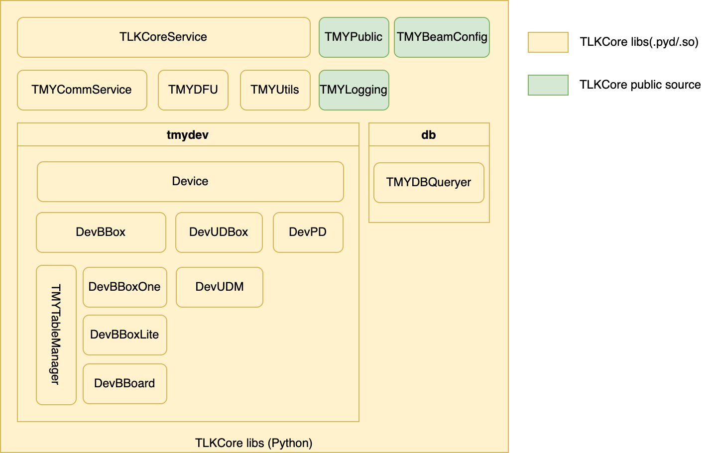

# TMYTEK TLKCore Documentation

* TMYTEK general API for Windows/Linux platform.

## Introduction

**TLKCore** is a core service which inside the TMXLAB Kit(TLK/WEB-TLK), it integrates Python built libraries which developing mmwave( n257 / n260 ) **beamforming** and **beam steering** applications on **BBox 5G Series(mmwave beamformer)** and **UDBox 5G Series(mmwave Up-down frequency converter)**.

The **.pyd** format release is for Windows shared library and **.so** format release is for Linux shared library. Python is a cross-platform programming language, and we provide the basic Python example for all devices/platforms in the release package, and C/C++ examples for Linux platform in **C_C++** folder. Please refer to the sample code inside each folder for the specific programming language.

### Architecture

* **TLKCoreService** is <u>main entry</u> for developer, all of operations/functions must passed by TLKCoreService, e.g. scanDevices(), initDev().
* TMYCommService is maintaining physical communications for all devices, it usually not handled directly by developer.
* TMYUtils defines all data structure for return data, let developer more easier to know current status of processed function.
* **TMYPublic** is a open source code, it defines all data structure which developer might used, e.g. RFMode(TX/RX), RetCode(OK/ERROR/...), UDState...etc.
* All files/function under tmydev/ are all operating logic of standard products
* db/ used for WEB-TLK, developer could ignore it.

  

#### Latest Release & Reference Guide

[[Download Link](https://github.com/tmytek/bbox-api/tree/master/example_Linux/TLKCore_release)]

## Prerequisites

* Python 3
  * Libraries support Python 3.6/3.8/3.10
* Related Python libs
    `pip install --trusted-host pypi.python.org --trusted-host files.pythonhosted.org --trusted-host pypi.org -r requirements.txt`
* USB driver for scanning/connect device (for device: UDM-0620)
  * [Installation Guides for all platforms](https://ftdichip.com/document/installation-guides/)
  * Windows
    * Online-Host with external internet capability
      * Auto detect a new device and install driver
    * Offline-Host
      * Download [setup executable driver from FTDI](https://ftdichip.com/drivers/d2xx-drivers/) and install it.
  * Linux
      1. Follow [steps](https://gitlab.com/msrelectronics/python-ft4222/-/tree/master#accessrights) to create or extend **/etc/udev/rules.d/99-ftdi.rules** includes:
          `SUBSYSTEM=="usb", ATTRS{idVendor}=="0403", ATTRS{idProduct}=="601c", GROUP="plugdev", MODE="0666"`
      2. Try to reload udev rules or re-plugin USB devices.
          `sudo udevadm control --reload-rules`
          `sudo udevadm trigger`

## Commandline

---
    python3 main.py
