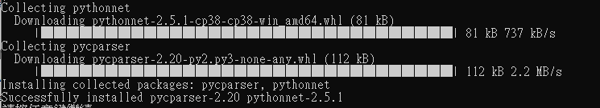

# BBox API Document
Version: v3.1.2.2
Release date: Apr., 2021

## Introduction

BBox API helps developers building their own applications. The release format is DLL and currently only support Windows operating system. The tested environment is Visual Studio and LabView 2019.

# Getting Started — Python
## Installation
----------

- Please install **pythonnet** at first. It's necessary for using windows dll in python script.

    You also could install pythonnet by launching <pre><code>pythonnet_installation\lib_install.bat</code></pre>
    

- Please create a folder, named "files" under current path, and then put the BBox beamsterring table in the folder.

## Initialization
----------
    clr.AddReference('BBoxLiteAPI')
    from BBoxAPI import *
    instance = BBoxAPI()
    instance.Init(sn, dev_type, idx)

To obtain the device information, you need to call ScanningDevice. The return string contains device SN, IP address and device type, spliting by ','.
Ex(UDBox) : UD-BD20231000-24,192.168.100.112,4

    dev_info = b.ScanningDevice(0);
    devone = dev_info[0].split(",")   # Suppose there is only one device
    sn = devone[0]
    ip = devone[1]
    if len(devone) > 2:
        dev_type = int(devone[2])
    else:
        dev_type = 0

Send the initialization code to BBoxOne/UDBox. Parameter sn/dev_type comes from the scanning results.

    info = instance.Init(sn, dev_type, idx);

## Control example
****
### General Device
#### Running python
    $ python .\UD_SetFreq.py

### UDBox

##### Set UD Frequency
The core function of UDBox is to control LO frequency for your IF & RF frequency. The following code is setting LO freq: 26GHz, RF: 28GHz, IF: 2GHz with bandwidth: 100MHz. You need to point out which UDBox device used by serial number.

    info = instance.SetUDFreq(26000000, 28000000, 2000000, 100000, sn)
****

# API parameters

----------
### ScanningDevice
    public string[] ScanningDevice(DEV_SCAN_MODE scanMode)
| Type          | Name     | Value                |
| ------------- | -------- | -------------------- |
| DEV_SCAN_MODE | scanMode | Normal : 0, Fast : 1 |

return scan results from devices

----------
### Init
    public String Init(sn, dev_type, idx);
| Type   | Name     | Value                           |
| ------ | -------- | ------------------------------- |
| String | sn       | Serial Number from scan result |
| int    | dev_type | Type from scan result           |
| int    | idx      | Index in scan result            |
return initialized condition.

----------
### GetState (UDBox only)
    public int GetState(int state_index, string sn)

| Type   | Name        | Value                                                                                                             |
| ------ | ----------- | ----------------------------------------------------------------------------------------------------------------- |
| int    | state_index | 0: Lock 1: CH1 2: CH2 3: 10M output 4: 100M output 5: 100M source 6: LED 100M 7: 5V 8: 9V |
| String | sn          | Device serial number                                                                                              |

return state from the state_index

### SetState (UDBox only)
    public int SetState(int state_index, int value, string sn)

| Type   | Name        | Value                                                                                                             |
| ------ | ----------- | ----------------------------------------------------------------------------------------------------------------- |
| int    | state_index | 0: Lock 1: CH1 2: CH2 3: 10M output 4: 100M output 5: 100M source 6: LED 100M 7: 5V 8: 9V |
| int    | value       | value                                                                                                             |
| String | sn          | Device serial number                                                                                              |

return state from the state_index

### Set Freq(UDBox only)
    public string SetUDFreq(double freq_ud, double freq_rf, double freq_if, double freq_bandwidth, string sn)
| Type   | Name           | Value                    |
| ------ | -------------- | ------------------------ |
| double | freq_ud        | UD/LO frequency(KHz)     |
| double | freq_rf        | RF frequency(KHz)        |
| double | freq_if        | IF frequency(KHz)        |
| double | freq_bandwidth | Bandwidth frequency(KHz) |
| String | sn             | Device serial number     |

return 0 if successful