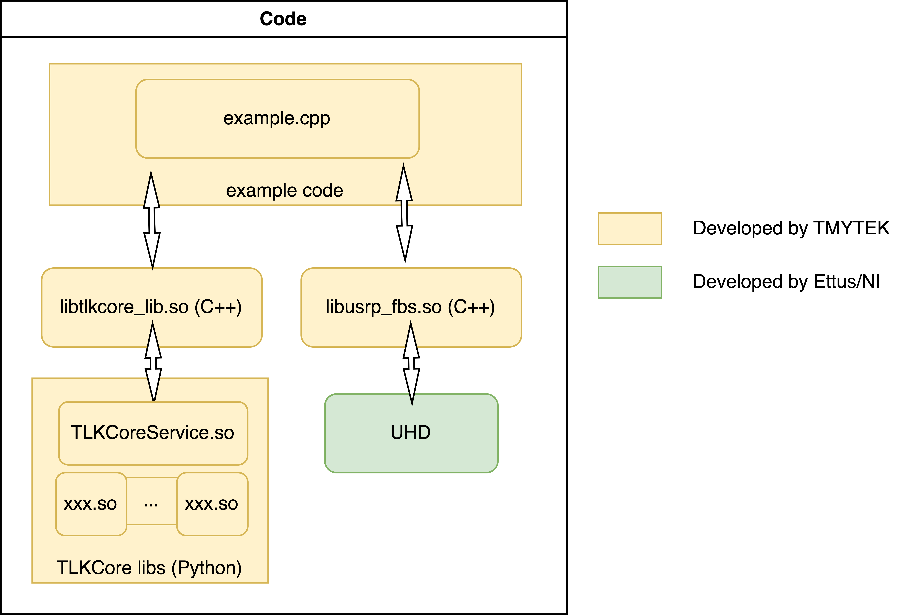

# Getting Started with C/C++ Sample Code

## Introduction

* Here is a C/C++ fast beamsteering example to control BBoxOne 5G via TLKCore, also control USRP to raise SPI signal via UHD driver to BBox.
* **lib_tlkcore_cpp/** includes a tiny C++ wrappper example, it generates to libtlkcore_lib.so
* [FBS] **lib_usrp_spi/** includes UHD application/library and it invoke pre-installed UHD driver to raise SPI transmissions for BBox 5G series, it grnerates to libusrp_fbs.so as default.
  * Developer can skip **FBS(fast beamsteering)** via examples/CMakeLists.txt, please reference [README under examples/](https://github.com/tmytek/bbox-api/tree/master/example_Linux/C_C%2B%2B/examples)
* **examples/** is a simple application which using libtlkcore_lib.so and libusrp_fbs.so to achieve BBox fast beam switching.
  

## Prerequisites

1. Install Python 3.6 or 3.8 or 3.10, and follow reference user guide of [Getting Started with Python Sample Code](https://github.com/tmytek/bbox-api/tree/master/example_Linux/Python/README.md)
2. For C/C++ supporting, please install related Python packages from lib_tlkcore_cpp/requirements.txt
    `pip install -r lib_tlkcore_cpp/requirements.txt`
