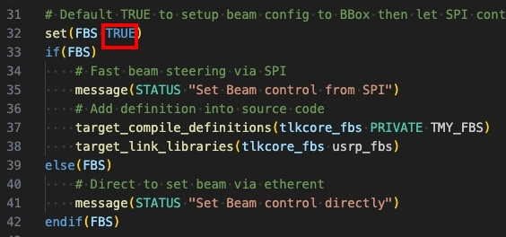

# Setup TLKCore configurations with C/C++ Sample Code

## Configuration files

* This example directory contains two sub directories, please configure to your own envirenment:
    1. example/files/ : [BBoxOne/Lite] Copy your calibration & antenna tables into **example/files/** under the [TLKCore_release](https://github.com/tmytek/bbox-api/tree/master/example_Linux/TLKCore_release), see more to [change default path](https://github.com/tmytek/bbox-api/tree/master/example_Linux/C_C%2B%2B/lib_tlkcore_cpp)
        * BBox calibration tables -> **{SN}_{Freq}GHz.csv**
        * BBox antenna table -> **AAKIT_{AAKitName}.csv**
    2. example/config/
        * **device.conf**, it mentions the device infomations for Beamform & UD.
          * *Beamform devices* with SN as key then includes AAKIT name and the path to beam configruation.
          * *UD devices* only includes SN as key then includes STATE with json format.
        * [FBS] **Beam configuration file**, i.g. CustomBatchBeams_D2230E058-28.csv. You can edit/pre-config it via Office-like software or any text editor, no matter what it is config to one of below options:
           * A whole beam (BeamType=0)
             * beam_db: gain with float type, please DO NOT exceed the DR (dynamic range).
             * beam_theta with integer degree
             * beam_phi with integer degree
           * Custom beam (BeamType=1), suggest use TMXLAB Kit first to makes sure your settings.
             * ch: Assigned channel to config
                * ch_sw: 0 means channel is ON, 1 is OFF.
                * ch_db: gain with float type.
                * ch_deg: phase degree with int type.
        * Note: lost fields always follow the rule of default beam/channel config
           * Must assign TX/RX, BeamID and BeamType
           * Default takes channel config (not a beam)
           * Default enabled
           * Default gives a max value of gain DR
           * Default gives degree 0 include theta,phi
           * ex: TX beam1 will be MAX of DR with degree (0, 0), and TX beam8 just modify ch 9~12 to 1dB
           

* There are some linked files, please build lib_tlkcore_cpp/ and lib_usrp_spi/ if necessary.
  * **libtlkcore_lib.so** -> ../lib_tlkcore_cpp/libtlkcore_lib.so
    * **include/tlkcore_lib.hpp** -> ../../lib_tlkcore_cpp/include/tlkcore_lib.hpp
  * [FBS] **libusrp_fbs.so** -> ../lib_usrp_spi/libusrp_fbs.so
  * **include/usrp_fbs.hpp** -> ../../lib_usrp_spi/include/usrp_fbs.hpp
* After libraries built, according to your Python environment, copy the extracted **lib/** & logging.conf from [TLKCore_release](https://github.com/tmytek/bbox-api/tree/master/example_Linux/TLKCore_release) to **example/lib/**, and we already placed libs for Python 3.8 as default.

## Building TLKCore C++ shared library using CMake

Please reference [Building TLKCore C++ shared library using CMake](https://github.com/tmytek/bbox-api/tree/master/example_Linux/C_C%2B%2B/lib_tlkcore_cpp)

## [FBS] Building UHD application/library using CMake

Please reference [Building UHD application/library using CMake](https://github.com/tmytek/bbox-api/tree/master/example_Linux/C_C%2B%2B/lib_usrp_spi)

## Building example applications using CMake

After above process, there are 2 build options to choose example runs for FBS or direct beam, FBS default is enabled, then runs the left commands.

1. Set build options to Enable FBS as TRUE or not, via edit examples/CMakeLists.txt
   
2. `mkdir build/` to creates a new build directory
3. `cd build/`
4. `cmake ..`
5. `make install`

## Execute the built binary

This directory contains the generated binary: tlkcore_fbs, just run the command under examples/:

      ./tlkcore_fbs
